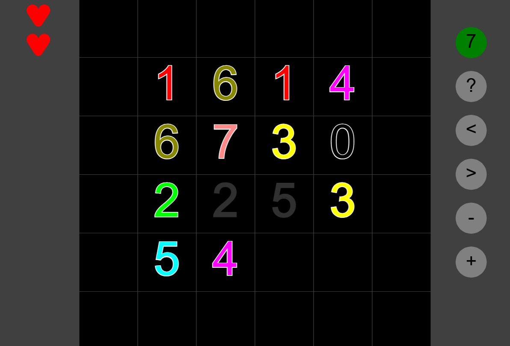

# Twins

[Try it!](https://christernilsson.github.io/2025/016-Twins2/index.html)

## Rules
* Find a pair with the Sum found in the top right corner
* The path must avoid other numbers
* The path must make zero, one or two turns
  * Three or more turns will cost you a heart
* Pairing with wrong sum costs one heart
* Pairing without a path costs two hearts
* Wrapping wraps around horizontal and vertical edges
* Wrapping costs one heart



## Picture

* 2+5 making the sum 7 was paired here
* 1+6 and 3+4 could also have been paired
* 0+7 couldn't be paired as there was no path connecting them

## Information
```
Sum : the number you aim for
  Green circle : One or more normal pairs available
  Yellow circle : One or more wrapping pairs available
  Red circle : No pairs available, game over
? : Help
< : First Sum, 1
> : Highest Sum so far
- : Decrease Sum by one
+ : Increase Sum by one
```
99 is maximum Sum.  
Board sizes varies between 2 by 2 and 10 by 10  
